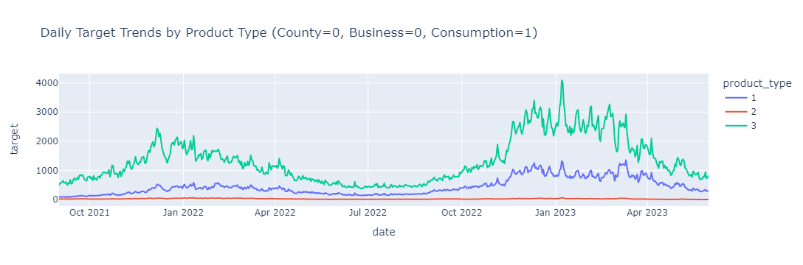
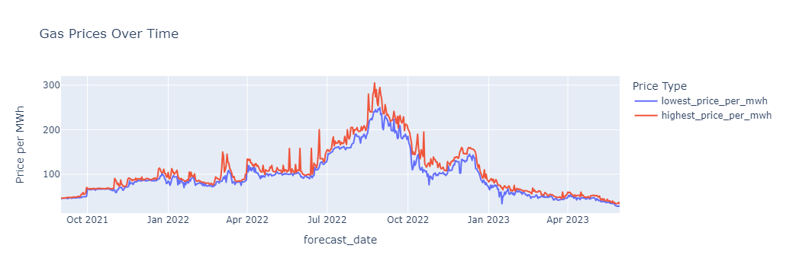
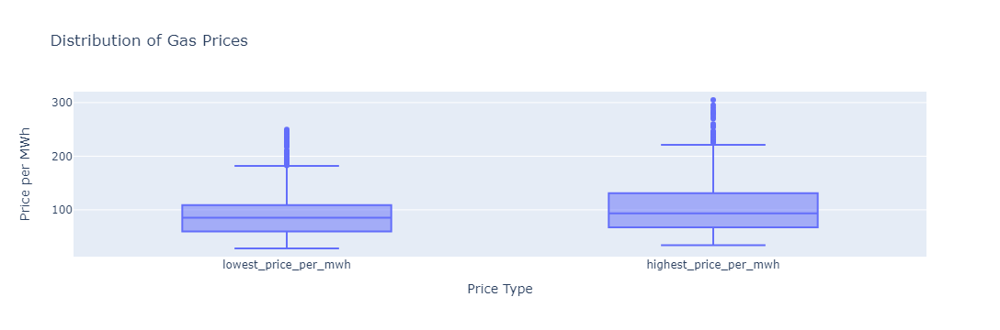
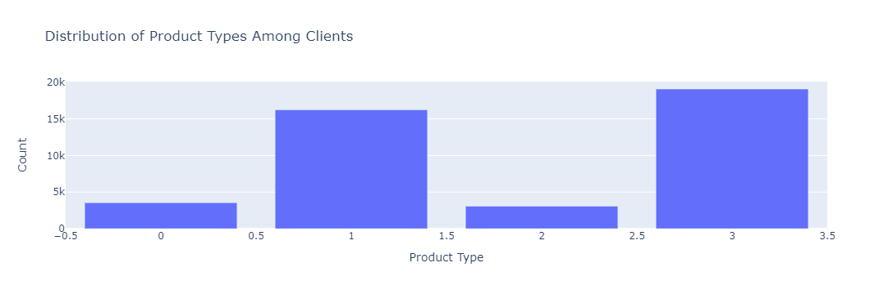
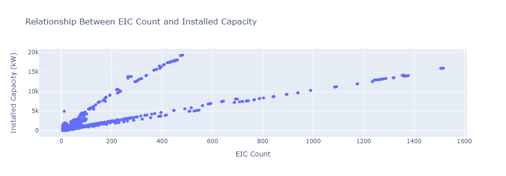
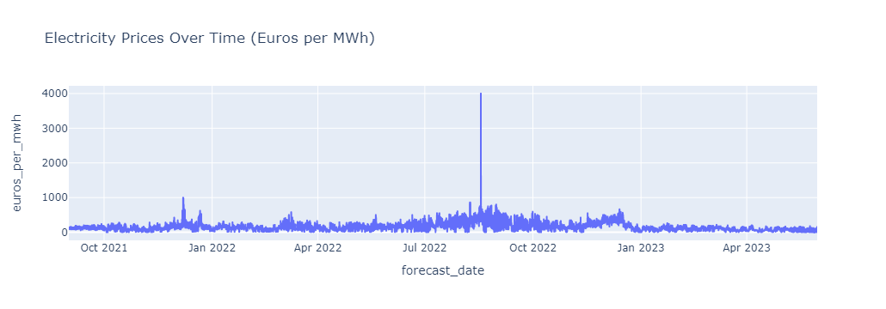
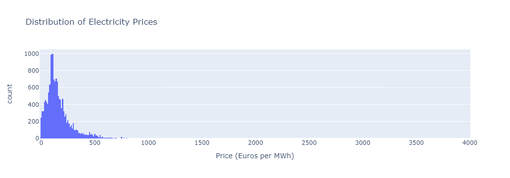

# Introduction to Enefit's Prosumer Energy Behavior Prediction Project
## Overview
### Background
The energy landscape is undergoing a transformative shift with the increasing integration of prosumers – entities that both produce and consume energy. This evolution presents unique challenges and opportunities in energy management, particularly in terms of grid stability and cost efficiency. Enefit, a leading energy company in the Baltic region, is at the forefront of addressing these challenges. Our project focuses on harnessing the power of data science to predict the energy behavior of prosumers, aiming to bring balance and efficiency to the energy grid.

### The Challenge
With the rise of renewable energy sources, especially solar energy, prosumers are playing a pivotal role in the energy ecosystem. However, their unpredictable energy production and consumption patterns can lead to grid imbalances and operational inefficiencies. The current forecasting models at Enefit have limitations in predicting these patterns accurately, resulting in elevated imbalance costs and grid instability. The objective of this project is to develop a more robust and accurate predictive model to forecast the energy behavior of prosumers, leveraging advanced data analytics and machine learning techniques.

### Project Goals
- **Improve Forecasting Accuracy:** Enhance the precision of our predictive models to better anticipate the energy production and consumption of prosumers.
- **Reduce Imbalance Costs:** By accurately forecasting energy behavior, reduce the costs associated with energy imbalance in the grid.
- **Enhance Grid Stability:** Contribute to a more stable and reliable energy grid, accommodating the dynamic nature of prosumer energy patterns.
- **Promote Sustainable Energy Practices:** Encourage the adoption of renewable energy by demonstrating effective management and integration of prosumer energy behavior into the wider energy system.

### Dataset Usage

The Dataset Used here is from the kaggle open competition : [check here](https://www.kaggle.com/competitions/predict-energy-behavior-of-prosumers/data)


```python
# This Python 3 environment comes with many helpful analytics libraries installed
# It is defined by the kaggle/python Docker image: https://github.com/kaggle/docker-python
# For example, here's several helpful packages to load

import numpy as np # linear algebra
import pandas as pd # data processing, CSV file I/O (e.g. pd.read_csv)

# Input data files are available in the read-only "../input/" directory
# For example, running this (by clicking run or pressing Shift+Enter) will list all files under the input directory

import os
for dirname, _, filenames in os.walk('predict-energy-behavior-of-prosumers'):
    for filename in filenames:
        print(os.path.join(dirname, filename))

# You can write up to 20GB to the current directory (/kaggle/working/) that gets preserved as output when you create a version using "Save & Run All" 
# You can also write temporary files to /kaggle/temp/, but they won't be saved outside of the current session
```

    predict-energy-behavior-of-prosumers\client.csv
    predict-energy-behavior-of-prosumers\county_id_to_name_map.json
    predict-energy-behavior-of-prosumers\electricity_prices.csv
    predict-energy-behavior-of-prosumers\forecast_weather.csv
    predict-energy-behavior-of-prosumers\gas_prices.csv
    predict-energy-behavior-of-prosumers\historical_weather.csv
    predict-energy-behavior-of-prosumers\public_timeseries_testing_util.py
    predict-energy-behavior-of-prosumers\train.csv
    predict-energy-behavior-of-prosumers\weather_station_to_county_mapping.csv
    predict-energy-behavior-of-prosumers\enefit\competition.cpython-310-x86_64-linux-gnu.so
    predict-energy-behavior-of-prosumers\enefit\__init__.py
    predict-energy-behavior-of-prosumers\example_test_files\client.csv
    predict-energy-behavior-of-prosumers\example_test_files\electricity_prices.csv
    predict-energy-behavior-of-prosumers\example_test_files\forecast_weather.csv
    predict-energy-behavior-of-prosumers\example_test_files\gas_prices.csv
    predict-energy-behavior-of-prosumers\example_test_files\historical_weather.csv
    predict-energy-behavior-of-prosumers\example_test_files\revealed_targets.csv
    predict-energy-behavior-of-prosumers\example_test_files\sample_submission.csv
    predict-energy-behavior-of-prosumers\example_test_files\test.csv
    

# Training Features

`county`
- Description: An ID code representing the county.
- Role in Analysis: This geographical identifier can be used to capture regional variations in energy consumption and production, possibly due to differences in weather, solar exposure, or economic activity.

`is_business`
- Description: A Boolean value indicating whether the prosumer is a business (True) or not (False).
- Role in Analysis: Businesses might have different consumption and production patterns compared to individual consumers, especially in terms of scale and timing.

`product_type`
- Description: An ID code representing the type of contract/product the prosumer has. For instance, "Combined", "Fixed", "General service", "Spot".
- Role in Analysis: Different product types may correlate with specific energy usage behaviors or preferences, impacting both consumption and production.

`target`
- Description: The actual consumption or production amount for the relevant segment for the hour.
- Role in Analysis: This is the dependent variable (what you are trying to predict). It represents the hourly energy consumption or production.

`is_consumption`
- Description: A Boolean value indicating whether the target value relates to consumption (True) or production (False).
- Role in Analysis: Distinguishes between energy consumption and production, which are likely to have different influencing factors and patterns.

`datetime`
- Description: The Estonian time (EET/EEST) indicating the start of the 1-hour period for which the target value is given.
- Role in Analysis: Time is a critical factor in forecasting. Patterns can be daily, weekly, seasonal, etc. This feature can be further broken down into more granular time-based features.

`data_block_id`
- Description: Identifier indicating all rows available at the same forecast time, related to the timing of data availability.
- Role in Analysis: Helps in organizing the data for model training and ensuring that forecasts are based on available data at the prediction time.

`row_id`
- Description: A unique identifier for each row.
- Role in Analysis: Primarily for data management and tracking. It's not usually used directly in predictive modeling.

`prediction`
- Description: Typically, this would be the output of your model - the predicted consumption or production amount.
- Role in Analysis: Used in the evaluation phase to compare against the actual target values to assess the accuracy of your model.

## What Needs to Be Predicted

The primary objective is to predict the `target` variable in the `train.csv` dataset, representing electricity consumption and production:

- **Electricity Consumption**: The amount of electricity consumed by a prosumer within a specific hour. This is indicated when the `is_consumption` feature is `True`.
- **Electricity Production**: The amount of electricity produced by a prosumer within a specific hour, typically via solar panels. This is indicated when the `is_consumption` feature is `False`.

Each prediction corresponds to a unique combination of factors like the county, business status of the prosumer (`is_business`), product type, and the specific hour (`datetime`).

## Model Evaluation

The model's predictions are evaluated for their accuracy against actual observed values. The evaluation metric used is the Mean Absolute Error (MAE), a standard for regression problems. MAE measures the average magnitude of errors in a set of predictions, without considering their direction. It's defined as: 

$
[ \text{MAE} = \frac{1}{n} \sum_{i=1}^{n} \left| y_i - \hat{y}_i \right| ]
$

Where:

- $( n )$ is the total number of data points.
- $( y_i )$ represents the actual observed value for data point \( i \).
- $( \hat{y}_i )$ is the predicted value for data point \( i \).

Lower MAE values indicate better predictive accuracy, as they reflect smaller average errors between predicted and actual values.

# Data


```python
import pandas as pd

root = 'predict-energy-behavior-of-prosumers'

train_df = pd.read_csv(os.path.join(root, 'train.csv'))
gas_prices_df = pd.read_csv(os.path.join(root, 'gas_prices.csv'))
client_df = pd.read_csv(os.path.join(root, 'client.csv'))
electricity_prices_df = pd.read_csv(os.path.join(root, 'electricity_prices.csv'))
forecast_weather_df = pd.read_csv(os.path.join(root, 'forecast_weather.csv'))
historical_weather_df = pd.read_csv(os.path.join(root, 'historical_weather.csv'))
weather_station_to_county_mapping_df = pd.read_csv(os.path.join(root, "weather_station_to_county_mapping.csv"))
```

# Training Data


```python
train_df.head()
```


<div>
<style scoped>
    .dataframe tbody tr th:only-of-type {
        vertical-align: middle;
    }

    .dataframe tbody tr th {
        vertical-align: top;
    }

    .dataframe thead th {
        text-align: right;
    }
</style>
<table border="1" class="dataframe">
  <thead>
    <tr style="text-align: right;">
      <th></th>
      <th>county</th>
      <th>is_business</th>
      <th>product_type</th>
      <th>target</th>
      <th>is_consumption</th>
      <th>datetime</th>
      <th>data_block_id</th>
      <th>row_id</th>
      <th>prediction_unit_id</th>
    </tr>
  </thead>
  <tbody>
    <tr>
      <th>0</th>
      <td>0</td>
      <td>0</td>
      <td>1</td>
      <td>0.713</td>
      <td>0</td>
      <td>2021-09-01 00:00:00</td>
      <td>0</td>
      <td>0</td>
      <td>0</td>
    </tr>
    <tr>
      <th>1</th>
      <td>0</td>
      <td>0</td>
      <td>1</td>
      <td>96.590</td>
      <td>1</td>
      <td>2021-09-01 00:00:00</td>
      <td>0</td>
      <td>1</td>
      <td>0</td>
    </tr>
    <tr>
      <th>2</th>
      <td>0</td>
      <td>0</td>
      <td>2</td>
      <td>0.000</td>
      <td>0</td>
      <td>2021-09-01 00:00:00</td>
      <td>0</td>
      <td>2</td>
      <td>1</td>
    </tr>
    <tr>
      <th>3</th>
      <td>0</td>
      <td>0</td>
      <td>2</td>
      <td>17.314</td>
      <td>1</td>
      <td>2021-09-01 00:00:00</td>
      <td>0</td>
      <td>3</td>
      <td>1</td>
    </tr>
    <tr>
      <th>4</th>
      <td>0</td>
      <td>0</td>
      <td>3</td>
      <td>2.904</td>
      <td>0</td>
      <td>2021-09-01 00:00:00</td>
      <td>0</td>
      <td>4</td>
      <td>2</td>
    </tr>
  </tbody>
</table>
</div>


# Gas Prices Data


```python
gas_prices_df.head()
```


<div>
<style scoped>
    .dataframe tbody tr th:only-of-type {
        vertical-align: middle;
    }

    .dataframe tbody tr th {
        vertical-align: top;
    }

    .dataframe thead th {
        text-align: right;
    }
</style>
<table border="1" class="dataframe">
  <thead>
    <tr style="text-align: right;">
      <th></th>
      <th>forecast_date</th>
      <th>lowest_price_per_mwh</th>
      <th>highest_price_per_mwh</th>
      <th>origin_date</th>
      <th>data_block_id</th>
    </tr>
  </thead>
  <tbody>
    <tr>
      <th>0</th>
      <td>2021-09-01</td>
      <td>45.23</td>
      <td>46.32</td>
      <td>2021-08-31</td>
      <td>1</td>
    </tr>
    <tr>
      <th>1</th>
      <td>2021-09-02</td>
      <td>45.62</td>
      <td>46.29</td>
      <td>2021-09-01</td>
      <td>2</td>
    </tr>
    <tr>
      <th>2</th>
      <td>2021-09-03</td>
      <td>45.85</td>
      <td>46.40</td>
      <td>2021-09-02</td>
      <td>3</td>
    </tr>
    <tr>
      <th>3</th>
      <td>2021-09-04</td>
      <td>46.30</td>
      <td>46.80</td>
      <td>2021-09-03</td>
      <td>4</td>
    </tr>
    <tr>
      <th>4</th>
      <td>2021-09-05</td>
      <td>46.30</td>
      <td>46.58</td>
      <td>2021-09-04</td>
      <td>5</td>
    </tr>
  </tbody>
</table>
</div>


# Client Data


```python
client_df.head()
```


<div>
<style scoped>
    .dataframe tbody tr th:only-of-type {
        vertical-align: middle;
    }

    .dataframe tbody tr th {
        vertical-align: top;
    }

    .dataframe thead th {
        text-align: right;
    }
</style>
<table border="1" class="dataframe">
  <thead>
    <tr style="text-align: right;">
      <th></th>
      <th>product_type</th>
      <th>county</th>
      <th>eic_count</th>
      <th>installed_capacity</th>
      <th>is_business</th>
      <th>date</th>
      <th>data_block_id</th>
    </tr>
  </thead>
  <tbody>
    <tr>
      <th>0</th>
      <td>1</td>
      <td>0</td>
      <td>108</td>
      <td>952.89</td>
      <td>0</td>
      <td>2021-09-01</td>
      <td>2</td>
    </tr>
    <tr>
      <th>1</th>
      <td>2</td>
      <td>0</td>
      <td>17</td>
      <td>166.40</td>
      <td>0</td>
      <td>2021-09-01</td>
      <td>2</td>
    </tr>
    <tr>
      <th>2</th>
      <td>3</td>
      <td>0</td>
      <td>688</td>
      <td>7207.88</td>
      <td>0</td>
      <td>2021-09-01</td>
      <td>2</td>
    </tr>
    <tr>
      <th>3</th>
      <td>0</td>
      <td>0</td>
      <td>5</td>
      <td>400.00</td>
      <td>1</td>
      <td>2021-09-01</td>
      <td>2</td>
    </tr>
    <tr>
      <th>4</th>
      <td>1</td>
      <td>0</td>
      <td>43</td>
      <td>1411.00</td>
      <td>1</td>
      <td>2021-09-01</td>
      <td>2</td>
    </tr>
  </tbody>
</table>
</div>


# electricity Prices Data


```python
electricity_prices_df.head()
```


<div>
<style scoped>
    .dataframe tbody tr th:only-of-type {
        vertical-align: middle;
    }

    .dataframe tbody tr th {
        vertical-align: top;
    }

    .dataframe thead th {
        text-align: right;
    }
</style>
<table border="1" class="dataframe">
  <thead>
    <tr style="text-align: right;">
      <th></th>
      <th>forecast_date</th>
      <th>euros_per_mwh</th>
      <th>origin_date</th>
      <th>data_block_id</th>
    </tr>
  </thead>
  <tbody>
    <tr>
      <th>0</th>
      <td>2021-09-01 00:00:00</td>
      <td>92.51</td>
      <td>2021-08-31 00:00:00</td>
      <td>1</td>
    </tr>
    <tr>
      <th>1</th>
      <td>2021-09-01 01:00:00</td>
      <td>88.90</td>
      <td>2021-08-31 01:00:00</td>
      <td>1</td>
    </tr>
    <tr>
      <th>2</th>
      <td>2021-09-01 02:00:00</td>
      <td>87.35</td>
      <td>2021-08-31 02:00:00</td>
      <td>1</td>
    </tr>
    <tr>
      <th>3</th>
      <td>2021-09-01 03:00:00</td>
      <td>86.88</td>
      <td>2021-08-31 03:00:00</td>
      <td>1</td>
    </tr>
    <tr>
      <th>4</th>
      <td>2021-09-01 04:00:00</td>
      <td>88.43</td>
      <td>2021-08-31 04:00:00</td>
      <td>1</td>
    </tr>
  </tbody>
</table>
</div>


# Forecast Weather Data


```python
forecast_weather_df.head()
```


<div>
<style scoped>
    .dataframe tbody tr th:only-of-type {
        vertical-align: middle;
    }

    .dataframe tbody tr th {
        vertical-align: top;
    }

    .dataframe thead th {
        text-align: right;
    }
</style>
<table border="1" class="dataframe">
  <thead>
    <tr style="text-align: right;">
      <th></th>
      <th>latitude</th>
      <th>longitude</th>
      <th>origin_datetime</th>
      <th>hours_ahead</th>
      <th>temperature</th>
      <th>dewpoint</th>
      <th>cloudcover_high</th>
      <th>cloudcover_low</th>
      <th>cloudcover_mid</th>
      <th>cloudcover_total</th>
      <th>10_metre_u_wind_component</th>
      <th>10_metre_v_wind_component</th>
      <th>data_block_id</th>
      <th>forecast_datetime</th>
      <th>direct_solar_radiation</th>
      <th>surface_solar_radiation_downwards</th>
      <th>snowfall</th>
      <th>total_precipitation</th>
    </tr>
  </thead>
  <tbody>
    <tr>
      <th>0</th>
      <td>57.6</td>
      <td>21.7</td>
      <td>2021-08-31 23:00:00+00:00</td>
      <td>1</td>
      <td>15.655786</td>
      <td>11.553613</td>
      <td>0.904816</td>
      <td>0.019714</td>
      <td>0.000000</td>
      <td>0.905899</td>
      <td>-0.411328</td>
      <td>-9.106137</td>
      <td>1</td>
      <td>2021-09-01 00:00:00+00:00</td>
      <td>0.0</td>
      <td>0.0</td>
      <td>0.0</td>
      <td>0.0</td>
    </tr>
    <tr>
      <th>1</th>
      <td>57.6</td>
      <td>22.2</td>
      <td>2021-08-31 23:00:00+00:00</td>
      <td>1</td>
      <td>13.003931</td>
      <td>10.689844</td>
      <td>0.886322</td>
      <td>0.004456</td>
      <td>0.000000</td>
      <td>0.886658</td>
      <td>0.206347</td>
      <td>-5.355405</td>
      <td>1</td>
      <td>2021-09-01 00:00:00+00:00</td>
      <td>0.0</td>
      <td>0.0</td>
      <td>0.0</td>
      <td>0.0</td>
    </tr>
    <tr>
      <th>2</th>
      <td>57.6</td>
      <td>22.7</td>
      <td>2021-08-31 23:00:00+00:00</td>
      <td>1</td>
      <td>14.206567</td>
      <td>11.671777</td>
      <td>0.729034</td>
      <td>0.005615</td>
      <td>0.000000</td>
      <td>0.730499</td>
      <td>1.451587</td>
      <td>-7.417905</td>
      <td>1</td>
      <td>2021-09-01 00:00:00+00:00</td>
      <td>0.0</td>
      <td>0.0</td>
      <td>0.0</td>
      <td>0.0</td>
    </tr>
    <tr>
      <th>3</th>
      <td>57.6</td>
      <td>23.2</td>
      <td>2021-08-31 23:00:00+00:00</td>
      <td>1</td>
      <td>14.844507</td>
      <td>12.264917</td>
      <td>0.336304</td>
      <td>0.074341</td>
      <td>0.000626</td>
      <td>0.385468</td>
      <td>1.090869</td>
      <td>-9.163999</td>
      <td>1</td>
      <td>2021-09-01 00:00:00+00:00</td>
      <td>0.0</td>
      <td>0.0</td>
      <td>0.0</td>
      <td>0.0</td>
    </tr>
    <tr>
      <th>4</th>
      <td>57.6</td>
      <td>23.7</td>
      <td>2021-08-31 23:00:00+00:00</td>
      <td>1</td>
      <td>15.293848</td>
      <td>12.458887</td>
      <td>0.102875</td>
      <td>0.088074</td>
      <td>0.000015</td>
      <td>0.176590</td>
      <td>1.268481</td>
      <td>-8.975766</td>
      <td>1</td>
      <td>2021-09-01 00:00:00+00:00</td>
      <td>0.0</td>
      <td>0.0</td>
      <td>0.0</td>
      <td>0.0</td>
    </tr>
  </tbody>
</table>
</div>


# Historical Weather Data


```python
historical_weather_df.head()
```


<div>
<style scoped>
    .dataframe tbody tr th:only-of-type {
        vertical-align: middle;
    }

    .dataframe tbody tr th {
        vertical-align: top;
    }

    .dataframe thead th {
        text-align: right;
    }
</style>
<table border="1" class="dataframe">
  <thead>
    <tr style="text-align: right;">
      <th></th>
      <th>datetime</th>
      <th>temperature</th>
      <th>dewpoint</th>
      <th>rain</th>
      <th>snowfall</th>
      <th>surface_pressure</th>
      <th>cloudcover_total</th>
      <th>cloudcover_low</th>
      <th>cloudcover_mid</th>
      <th>cloudcover_high</th>
      <th>windspeed_10m</th>
      <th>winddirection_10m</th>
      <th>shortwave_radiation</th>
      <th>direct_solar_radiation</th>
      <th>diffuse_radiation</th>
      <th>latitude</th>
      <th>longitude</th>
      <th>data_block_id</th>
    </tr>
  </thead>
  <tbody>
    <tr>
      <th>0</th>
      <td>2021-09-01 00:00:00</td>
      <td>14.2</td>
      <td>11.6</td>
      <td>0.0</td>
      <td>0.0</td>
      <td>1015.9</td>
      <td>31</td>
      <td>31</td>
      <td>0</td>
      <td>11</td>
      <td>7.083333</td>
      <td>8</td>
      <td>0.0</td>
      <td>0.0</td>
      <td>0.0</td>
      <td>57.6</td>
      <td>21.7</td>
      <td>1.0</td>
    </tr>
    <tr>
      <th>1</th>
      <td>2021-09-01 00:00:00</td>
      <td>13.9</td>
      <td>11.5</td>
      <td>0.0</td>
      <td>0.0</td>
      <td>1010.7</td>
      <td>33</td>
      <td>37</td>
      <td>0</td>
      <td>0</td>
      <td>5.111111</td>
      <td>359</td>
      <td>0.0</td>
      <td>0.0</td>
      <td>0.0</td>
      <td>57.6</td>
      <td>22.2</td>
      <td>1.0</td>
    </tr>
    <tr>
      <th>2</th>
      <td>2021-09-01 00:00:00</td>
      <td>14.0</td>
      <td>12.5</td>
      <td>0.0</td>
      <td>0.0</td>
      <td>1015.0</td>
      <td>31</td>
      <td>34</td>
      <td>0</td>
      <td>0</td>
      <td>6.333333</td>
      <td>355</td>
      <td>0.0</td>
      <td>0.0</td>
      <td>0.0</td>
      <td>57.6</td>
      <td>22.7</td>
      <td>1.0</td>
    </tr>
    <tr>
      <th>3</th>
      <td>2021-09-01 00:00:00</td>
      <td>14.6</td>
      <td>11.5</td>
      <td>0.0</td>
      <td>0.0</td>
      <td>1017.3</td>
      <td>0</td>
      <td>0</td>
      <td>0</td>
      <td>0</td>
      <td>8.083333</td>
      <td>297</td>
      <td>358.0</td>
      <td>277.0</td>
      <td>81.0</td>
      <td>57.6</td>
      <td>23.2</td>
      <td>1.0</td>
    </tr>
    <tr>
      <th>4</th>
      <td>2021-09-01 00:00:00</td>
      <td>15.7</td>
      <td>12.9</td>
      <td>0.0</td>
      <td>0.0</td>
      <td>1014.0</td>
      <td>22</td>
      <td>25</td>
      <td>0</td>
      <td>0</td>
      <td>8.416667</td>
      <td>5</td>
      <td>0.0</td>
      <td>0.0</td>
      <td>0.0</td>
      <td>57.6</td>
      <td>23.7</td>
      <td>1.0</td>
    </tr>
  </tbody>
</table>
</div>


# Weather Station to county mapping


```python
weather_station_to_county_mapping_df.head()
```


<div>
<style scoped>
    .dataframe tbody tr th:only-of-type {
        vertical-align: middle;
    }

    .dataframe tbody tr th {
        vertical-align: top;
    }

    .dataframe thead th {
        text-align: right;
    }
</style>
<table border="1" class="dataframe">
  <thead>
    <tr style="text-align: right;">
      <th></th>
      <th>county_name</th>
      <th>longitude</th>
      <th>latitude</th>
      <th>county</th>
    </tr>
  </thead>
  <tbody>
    <tr>
      <th>0</th>
      <td>NaN</td>
      <td>21.7</td>
      <td>57.6</td>
      <td>NaN</td>
    </tr>
    <tr>
      <th>1</th>
      <td>NaN</td>
      <td>21.7</td>
      <td>57.9</td>
      <td>NaN</td>
    </tr>
    <tr>
      <th>2</th>
      <td>NaN</td>
      <td>21.7</td>
      <td>58.2</td>
      <td>NaN</td>
    </tr>
    <tr>
      <th>3</th>
      <td>NaN</td>
      <td>21.7</td>
      <td>58.5</td>
      <td>NaN</td>
    </tr>
    <tr>
      <th>4</th>
      <td>NaN</td>
      <td>21.7</td>
      <td>58.8</td>
      <td>NaN</td>
    </tr>
  </tbody>
</table>
</div>


# Observe the Data Trends


```python
# Convert datetime columns to datetime format
train_df['datetime'] = pd.to_datetime(train_df['datetime'])
forecast_weather_df['forecast_datetime'] = pd.to_datetime(forecast_weather_df['forecast_datetime'])
historical_weather_df['datetime'] = pd.to_datetime(historical_weather_df['datetime'])
```


```python
import pandas as pd
import plotly.express as px

# Filter based on conditions
county = 0
is_business = 0
is_consumption = 1

filtered_df = train_df[
    (train_df['county'] == county) &
    (train_df['is_business'] == is_business) &
    (train_df['is_consumption'] == is_consumption)
].copy() 

# Aggregating data to daily level
filtered_df['date'] = filtered_df['datetime'].dt.date
daily_df = filtered_df.groupby(['date', 'product_type']).agg({'target':'mean'}).reset_index()

# Plotting all product types on the same plot
fig = px.line(
    daily_df, 
    x="date", 
    y="target", 
    color='product_type', 
    title=f'Daily Target Trends by Product Type (County={county}, Business={is_business}, Consumption={is_consumption})'
)
fig.show()
```



**Seasonal Trends:** There appears to be a seasonal pattern in the target values for at least one of the product types (product type 3). It shows significant peaks and troughs that repeat over time, suggesting a strong seasonal influence on energy consumption or production.

**Product Type Variance:** The different product types show distinct levels of target values. Product type 3 (the green line) generally has much higher target values than types 2 and 1. This could indicate that customers with product type 3 consume or produce more energy or that there are more customers of this product type.

**Sharp Peaks:** There are some very sharp peaks observed for product type 3, particularly noticeable around the start of 2022 and the beginning of 2023. This might correspond to extreme weather events that caused spikes in energy consumption or production, or it could indicate data anomalies or outliers that warrant further investigation.

**Stable but Different Trends:** Product types 2 and 1 (the red and blue lines) seem to have much more stable and lower target values over time, with product type 2 consistently lower than product type 1. The stability might suggest that these product types are less affected by seasonal changes, or that they have a more consistent consumption or production pattern.

**Overall Decreasing Trend:** For product type 3, after reaching a peak around January 2022, there's a noticeable decreasing trend. It is unclear whether this is due to a seasonal decline or a longer-term decrease in consumption or production levels.

**Comparison Between Product Types:** There’s a considerable gap between the target values of product type 3 and the other types. This could imply that different product types are designed for different scales of consumption or production, with type 3 possibly being for larger scale consumers/producers.

**Data Range:** The data spans from approximately October 2021 to April 2023, giving a good overview of over a year and a half. This range allows for the observation of annual cycles and potentially the identification of year-over-year changes or trends.


```python
# Convert 'forecast_date' or 'origin_date' to datetime format
gas_prices_df['forecast_date'] = pd.to_datetime(gas_prices_df['forecast_date'])  # Adjust as needed

# Plotting gas prices over time with Plotly
fig = px.line(gas_prices_df, x='forecast_date', y=['lowest_price_per_mwh', 'highest_price_per_mwh'],
              labels={'value':'Price per MWh', 'variable':'Price Type'},
              title='Gas Prices Over Time')
fig.show()
```


**Volatility in Prices:** There is noticeable volatility in gas prices. Both the highest and the lowest prices show significant fluctuations over the observed period.

**Price Range:** The gap between the highest and lowest prices at any given time suggests a wide range of trading prices for natural gas, which may reflect market dynamics such as supply and demand fluctuations, geopolitical events, or other economic factors.

**Trend Changes:** The graph exhibits multiple points where the trend changes direction. Notably, after a period of rising prices, there is a sharp increase that peaks around the middle of the graph, followed by a significant decrease. This peak might correspond to a particular event or season that caused gas prices to spike.

**Seasonal Patterns:** There might be seasonal patterns present, as indicated by the recurring peaks and troughs. This could be due to seasonal demand changes, with higher prices possibly in the colder months when heating demand increases.

**Convergence of Prices:** Towards the right end of the graph, the highest and lowest prices appear to converge, indicating a period where the market was less volatile or where the range of trading prices was narrower.

**Overall Trend**: While there is a lot of short-term fluctuation, the overall trend from the start to the end of the period shows an increase followed by a decrease in gas prices. This could suggest that whatever factors caused the increase in prices may have been resolved or mitigated towards the later part of the observed timeframe.

**Potential Anomalies:** The sharp spikes, especially in the highest price data, suggest that there could be anomalies or extreme market events that have caused temporary but significant price surges.

**Data Range:** The data covers from approximately October 2021 to April 2023, which allows for observing the price dynamics over one and a half years, capturing any annual cycles or long-term trends.


```python
# Creating a box plot with Plotly
fig = px.box(gas_prices_df, y=['lowest_price_per_mwh', 'highest_price_per_mwh'],
             labels={'value':'Price per MWh', 'variable':'Price Type'},
             title='Distribution of Gas Prices')
fig.show()
```



**Central Tendency:** The median of both the lowest(`85.21`) and highest(`93.47`) prices is visible as the line within the box. The median of the highest prices seems to be higher than that of the lowest prices, which is expected.

**Spread of Prices:** The boxes represent the interquartile range (IQR), which is the middle 50% of the data. The IQR for the highest prices is broader than for the lowest prices, indicating more variability in the highest prices.

**Symmetry of Distribution:** The distribution of the lowest prices appears to be more symmetric around the median, while the highest prices distribution is skewed upwards, with the median closer to the bottom of the box.

**Outliers:** There are individual points above the 'whiskers' of the boxes, which are considered outliers. The highest prices have more outliers, which indicates more frequent extreme values compared to the lowest prices.

**Price Extremes:** The 'whiskers' extend to the minimum and maximum values within 1.5 * IQR from the lower and upper quartiles, respectively. The highest prices have a higher maximum value and also a higher minimum value compared to the lowest prices.

**Comparison Between Price Types:** The range of the highest prices is wider than that of the lowest prices, which suggests that the highest prices are more volatile and subject to larger fluctuations.

**Market Dynamics:** The presence of outliers, especially for the highest prices, could reflect volatile market conditions or specific events that caused price spikes.


```python
product_type_counts = client_df['product_type'].value_counts().reset_index()
product_type_counts.columns = ['Product Type', 'Count']

# Creating a bar plot for product type distribution
fig = px.bar(product_type_counts, 
             x='Product Type', 
             y='Count', 
             title='Distribution of Product Types Among Clients')
fig.show()
```


**Popularity of Product Types:** Product type 1 and product type 3 are the most common among clients, with product type 3 being the most popular by a significant margin.

**Least Popular Product:** Product type 2 is the least common among the clients, as indicated by its much lower bar.

**Potential Market Preferences:** The chart suggests that whatever features or benefits offered by product type 3 make it the preferred choice among clients. This might be due to better pricing, more suitable terms, or other factors that make it attractive.

**Product Type 0 Presence:** There is a small number of clients who have product type 0, which might be a specialized or less known product offering.

**Strategic Implications:** For the company, the popularity of product types could inform marketing strategies, product development, and client relationship management.


```python
# Creating a scatter plot for eic_count vs installed_capacity
fig = px.scatter(client_df, 
                 x='eic_count', 
                 y='installed_capacity', 
                 labels={'eic_count': 'EIC Count', 'installed_capacity': 'Installed Capacity (kW)'},
                 title='Relationship Between EIC Count and Installed Capacity')
fig.show()
```



**Positive Correlation:** There is a clear positive correlation between the number of EICs and the installed capacity. This suggests that as the number of consumption points increases, so does the installed capacity, which could indicate that clients with more consumption points tend to invest in more substantial energy production capabilities.

**Clusters and Patterns:** There are clusters of data points that may represent common sizes or types of clients. For example, a cluster of points with a low EIC count and low installed capacity could represent individual residential clients, while points with higher values on both axes could represent commercial or industrial clients.

**Outliers:** There are a few points with a high installed capacity but a relatively low EIC count. These could be clients who have invested heavily in energy production capacity despite having fewer individual consumption points, such as a small business with a large solar panel installation.

**Scaling Relationship:** The relationship doesn't appear to be strictly linear, as the scatter plot shows that increases in EIC count sometimes lead to a more than proportional increase in installed capacity. This might indicate economies of scale or preferential investment in larger capacity systems by clients with more consumption points.

**Data Distribution:** The majority of data points are concentrated at the lower end of both the EIC count and installed capacity, which is typical for many types of distributions where a large number of clients have small installations.

**Plateaus:** There seem to be certain levels at which the installed capacity plateaus, especially noticeable in the mid-range of the EIC count. This might suggest standardization in the sizes of installations offered to clients.

**Maximum Capacities:** For the highest EIC counts, the installed capacity increases significantly, indicating that clients with many consumption points may have access to or requirements for very high capacity installations.


```python
# Convert 'forecast_date' to datetime format
electricity_prices_df['forecast_date'] = pd.to_datetime(electricity_prices_df['forecast_date'])

# Plotting electricity prices over time with Plotly
fig = px.line(electricity_prices_df, x='forecast_date', y='euros_per_mwh',
              title='Electricity Prices Over Time (Euros per MWh)')
fig.show()
```



**Price Spikes:** There are occasional dramatic spikes in electricity prices, with one particularly noticeable peak that far exceeds the typical price range. This could indicate times of high demand, limited supply, or other market disruptions.

**Volatility:** The prices show volatility, with many ups and downs over the observed period. This is characteristic of energy markets, which can be influenced by a variety of factors such as changes in demand, fuel prices, regulatory changes, and broader economic conditions.

**Trend Analysis:** Excluding the spikes, the general trend seems to show some periods with relatively higher prices, especially noticeable in the early months of the graph, and a more stable period towards the end. This may suggest an initial instability in the market that gradually settles down.

**Seasonal Fluctuations:** There seems to be a pattern of fluctuation that could correspond to seasonal changes in demand, often linked to heating in winter and cooling in summer.

**Anomalies:** The extreme spikes might be outliers or anomalies that could be due to reporting errors, exceptional market conditions, or once-off events that drastically changed the price for short periods.

**Data Range:** The data spans from approximately October 2021 to April 2023, which includes at least two winter periods where higher prices might be expected due to increased heating demand.

**Market Stability:** The latter part of the time series shows less fluctuation in prices, which could suggest increased market stability or the effect of regulatory mechanisms to smooth out price volatility.


```python
# Creating a histogram for electricity prices
fig = px.histogram(electricity_prices_df, x='euros_per_mwh',
                   title='Distribution of Electricity Prices',
                   labels={'euros_per_mwh': 'Price (Euros per MWh)'})
fig.show()
```


**Price Concentration:** The majority of the electricity prices are concentrated at the lower end of the spectrum. This suggests that lower prices occur more frequently than higher prices.

**Long Tail Distribution:** The distribution has a long right tail, indicating that while most prices are low, there is a significant spread with a few occurrences of very high prices.

**Presence of Outliers:** The long tail extending towards the higher price range also suggests the presence of outliers or extreme values. These could represent periods of peak demand, reduced supply, or other exceptional market conditions.

**Skewed Distribution:** The distribution is right-skewed, meaning that the median price of electricity is likely lower than the mean price due to the influence of these high-price outliers.

**Typical Price Range:** The bulk of the data falls within a relatively narrow price range, which could be considered the typical market price under normal conditions.

**Market Dynamics:** The outliers at the higher end could be indicative of volatility in the energy market, possibly influenced by external factors like fuel costs, regulatory changes, or significant shifts in supply and demand.

**Pricing Strategies:** For energy suppliers and consumers, understanding this distribution can be important for pricing strategies and risk management, especially considering the potential financial impact of the high-price outliers.


```python
# Plotting temperature over time with Plotly
fig = px.line(forecast_weather_df, x='forecast_datetime', y='temperature',
              title='Temperature Trends Over Time')
fig.show()
```

**Seasonal Patterns:** The graph shows a clear seasonal pattern, with temperatures peaking during the summer months and reaching lows during the winter months. This is a typical pattern in regions with four distinct seasons.

**Temperature Range:** The temperature varies from below -20°C during the coldest periods to above 30°C during the warmest periods, indicating a location with a wide range of temperatures and possibly a continental climate.

**Consistency Year Over Year:** By looking at the peaks and troughs, it appears that the temperature trends are consistent year over year, with similar patterns repeating across the two winters and summers visible in the data.

**Extreme Weather Events:** The sharpest drops in temperature, especially those that go below -20°C, could indicate extreme weather events or cold waves.

**Warming and Cooling Periods:** The transition periods between the cold and warm temperatures appear to be gradual, showing a steady increase in temperature from winter to summer and a steady decrease from summer to winter.

**Data Quality:** The continuous nature of the temperature line suggests that the data is of high quality with no apparent gaps or missing data points.

**Implications for Energy Use:** Such temperature trends are critical for energy consumption forecasting, as demand for heating and cooling is closely tied to temperature. Energy providers and grid operators can use this information for planning and optimizing the energy supply.

# Feature Engineering


```python
!pip install polars
```

    Requirement already satisfied: polars in c:\users\vtant\anaconda3\lib\site-packages (0.19.19)
    


```python
root = "predict-energy-behavior-of-prosumers"

train_df_cols = ['target', 'county', 'is_business', 'product_type', 'is_consumption', 'datetime', 'row_id']
client_df_cols = ['product_type', 'county', 'eic_count', 'installed_capacity', 'is_business', 'date']
gas_prices_df_cols = ['forecast_date', 'lowest_price_per_mwh', 'highest_price_per_mwh']
electricity_prices_df_cols = ['forecast_date', 'euros_per_mwh']
forecast_weather_df_cols = ['latitude', 'longitude', 'hours_ahead', 'temperature', 'dewpoint', 'cloudcover_high', 'cloudcover_low', 'cloudcover_mid', 'cloudcover_total', '10_metre_u_wind_component', '10_metre_v_wind_component', 'forecast_datetime', 'direct_solar_radiation', 'surface_solar_radiation_downwards', 'snowfall', 'total_precipitation']
historical_weather_df_cols = ['datetime', 'temperature', 'dewpoint', 'rain', 'snowfall', 'surface_pressure','cloudcover_total','cloudcover_low','cloudcover_mid','cloudcover_high','windspeed_10m','winddirection_10m','shortwave_radiation','direct_solar_radiation','diffuse_radiation','latitude','longitude']
location_df_cols = ['longitude', 'latitude', 'county']
target_df_cols = ['target', 'county', 'is_business', 'product_type', 'is_consumption', 'datetime']
```


```python
import polars as pl
train_data_df = pl.read_csv(os.path.join(root, "train.csv"), columns=train_df_cols, try_parse_dates=True)
client_df = pl.read_csv(os.path.join(root, "client.csv"), columns=client_df_cols, try_parse_dates=True)
gas_prices_df = pl.read_csv(os.path.join(root, "gas_prices.csv"), columns=gas_prices_df_cols, try_parse_dates=True)
electricity_prices_df = pl.read_csv(os.path.join(root, "electricity_prices.csv"), columns=electricity_prices_df_cols, try_parse_dates=True)
forecast_weather_df = pl.read_csv(os.path.join(root, "forecast_weather.csv"), columns=forecast_weather_df_cols, try_parse_dates=True)
historical_weather_df = pl.read_csv(os.path.join(root, "historical_weather.csv"), columns=historical_weather_df_cols, try_parse_dates=True)
weather_station_to_county_mapping_df = pl.read_csv(os.path.join(root, "weather_station_to_county_mapping.csv"), columns=location_df_cols, try_parse_dates=True)
target_df = train_data_df.select(target_df_cols)

schema_data = train_data_df.schema
schema_client = client_df.schema
schema_gas  = gas_prices_df.schema
schema_electricity = electricity_prices_df.schema
schema_forecast = forecast_weather_df.schema
schema_historical = historical_weather_df.schema
schema_target = target_df.schema
```


```python
def generate_features(
        df_data, 
        df_client, 
        df_gas_prices, 
        df_electricity_prices, 
        df_forecast_weather, 
        df_historical_weather, 
        df_weather_station_to_county_mapping, 
        df_target
):
    df_train = (
        df_data
        .with_columns(
            pl.col("datetime").cast(pl.Date).alias("date"),
        )
    )
    
    df_gas_prices = (
        df_gas_prices
        .rename({"forecast_date": "date"})
    )
    
    df_electricity_prices = (
        df_electricity_prices
        .rename({"forecast_date": "datetime"})
    )
    
    df_weather_station_to_county_mapping = (
        df_weather_station_to_county_mapping
        .with_columns(
            pl.col("latitude").cast(pl.datatypes.Float32),
            pl.col("longitude").cast(pl.datatypes.Float32)
        )
    )
    
    # sum of all product_type targets related to ["datetime", "county", "is_business", "is_consumption"]
    df_target_all_type_sum = (
        df_target
        .group_by(["datetime", "county", "is_business", "is_consumption"]).sum()
        .drop("product_type")
    )
    
    df_forecast_weather = (
        df_forecast_weather
        .rename({"forecast_datetime": "datetime"})
        .filter(pl.col("hours_ahead") >= 24) # we don't need forecast for today
        .with_columns(
            pl.col("latitude").cast(pl.datatypes.Float32),
            pl.col("longitude").cast(pl.datatypes.Float32),
            # datetime for forecast in a different timezone
            pl.col('datetime').dt.convert_time_zone("Europe/Bucharest").dt.replace_time_zone(None).cast(pl.Datetime("us")),
        )
        .join(df_weather_station_to_county_mapping, how="left", on=["longitude", "latitude"])
        .drop("longitude", "latitude")
    )
    
    df_historical_weather = (
        df_historical_weather
        .with_columns(
            pl.col("latitude").cast(pl.datatypes.Float32),
            pl.col("longitude").cast(pl.datatypes.Float32),
#            pl.col("datetime") + pl.duration(hours=37)
        )
        .join(df_weather_station_to_county_mapping, how="left", on=["longitude", "latitude"])
        .drop("longitude", "latitude")
    )
    
    # creating average forecast characteristics for all weather stations
    df_forecast_weather_date = (
        df_forecast_weather
        .group_by("datetime").mean()
        .drop("county")
    )
    
    # creating average forecast characteristics for weather stations related to county
    df_forecast_weather_local = (
        df_forecast_weather
        .filter(pl.col("county").is_not_null())
        .group_by("county", "datetime").mean()
    )
    
    # creating average historical characteristics for all weather stations
    df_historical_weather_date = (
        df_historical_weather
        .group_by("datetime").mean()
        .drop("county")
    )
    
    # creating average historical characteristics for weather stations related to county
    df_historical_weather_local = (
        df_historical_weather
        .filter(pl.col("county").is_not_null())
        .group_by("county", "datetime").mean()
    )
    
    df_train = (
        df_train
        # pl.duration(days=1) shifts datetime to join lag features (usually we join last available values)
        .join(df_gas_prices.with_columns((pl.col("date") + pl.duration(days=1)).cast(pl.Date)), on="date", how="left")
        .join(df_client.with_columns((pl.col("date") + pl.duration(days=2)).cast(pl.Date)), on=["county", "is_business", "product_type", "date"], how="left")
        .join(df_electricity_prices.with_columns(pl.col("datetime") + pl.duration(days=1)), on="datetime", how="left")
        
        # lag forecast_weather features (24 hours * days)
        .join(df_forecast_weather_date, on="datetime", how="left", suffix="_fd")
        .join(df_forecast_weather_local, on=["county", "datetime"], how="left", suffix="_fl")
        .join(df_forecast_weather_date.with_columns(pl.col("datetime") + pl.duration(days=7)), on="datetime", how="left", suffix="_fd_7d")
        .join(df_forecast_weather_local.with_columns(pl.col("datetime") + pl.duration(days=7)), on=["county", "datetime"], how="left", suffix="_fl_7d")

        # lag historical_weather features (24 hours * days)
        .join(df_historical_weather_date.with_columns(pl.col("datetime") + pl.duration(days=2)), on="datetime", how="left", suffix="_hd_2d")
        .join(df_historical_weather_local.with_columns(pl.col("datetime") + pl.duration(days=2)), on=["county", "datetime"], how="left", suffix="_hl_2d")
        .join(df_historical_weather_date.with_columns(pl.col("datetime") + pl.duration(days=7)), on="datetime", how="left", suffix="_hd_7d")
        .join(df_historical_weather_local.with_columns(pl.col("datetime") + pl.duration(days=7)), on=["county", "datetime"], how="left", suffix="_hl_7d")
        
        # lag target features (24 hours * days)
        .join(df_target.with_columns(pl.col("datetime") + pl.duration(days=2)).rename({"target": "target_1"}), on=["county", "is_business", "product_type", "is_consumption", "datetime"], how="left")
        .join(df_target.with_columns(pl.col("datetime") + pl.duration(days=3)).rename({"target": "target_2"}), on=["county", "is_business", "product_type", "is_consumption", "datetime"], how="left")
        .join(df_target.with_columns(pl.col("datetime") + pl.duration(days=4)).rename({"target": "target_3"}), on=["county", "is_business", "product_type", "is_consumption", "datetime"], how="left")
        .join(df_target.with_columns(pl.col("datetime") + pl.duration(days=5)).rename({"target": "target_4"}), on=["county", "is_business", "product_type", "is_consumption", "datetime"], how="left")
        .join(df_target.with_columns(pl.col("datetime") + pl.duration(days=6)).rename({"target": "target_5"}), on=["county", "is_business", "product_type", "is_consumption", "datetime"], how="left")
        .join(df_target.with_columns(pl.col("datetime") + pl.duration(days=7)).rename({"target": "target_6"}), on=["county", "is_business", "product_type", "is_consumption", "datetime"], how="left")
        .join(df_target.with_columns(pl.col("datetime") + pl.duration(days=14)).rename({"target": "target_7"}), on=["county", "is_business", "product_type", "is_consumption", "datetime"], how="left")
        
        .join(df_target_all_type_sum.with_columns(pl.col("datetime") + pl.duration(days=2)).rename({"target": "target_1"}), on=["county", "is_business", "is_consumption", "datetime"], suffix="_all_type_sum", how="left")
        .join(df_target_all_type_sum.with_columns(pl.col("datetime") + pl.duration(days=3)).rename({"target": "target_2"}), on=["county", "is_business", "is_consumption", "datetime"], suffix="_all_type_sum", how="left")
        .join(df_target_all_type_sum.with_columns(pl.col("datetime") + pl.duration(days=7)).rename({"target": "target_6"}), on=["county", "is_business", "is_consumption", "datetime"], suffix="_all_type_sum", how="left")
        .join(df_target_all_type_sum.with_columns(pl.col("datetime") + pl.duration(days=14)).rename({"target": "target_7"}), on=["county", "is_business", "is_consumption", "datetime"], suffix="_all_type_sum", how="left")
        
        
        .with_columns(
            pl.col("datetime").dt.ordinal_day().alias("dayofyear"),
            pl.col("datetime").dt.hour().alias("hour"),
            pl.col("datetime").dt.day().alias("day"),
            pl.col("datetime").dt.weekday().alias("weekday"),
            pl.col("datetime").dt.month().alias("month"),
            pl.col("datetime").dt.year().alias("year"),
        )
        
        .with_columns(
            pl.concat_str("county", "is_business", "product_type", "is_consumption", separator="_").alias("segment"),
        )
        
        # cyclical features encoding https://towardsdatascience.com/cyclical-features-encoding-its-about-time-ce23581845ca
        .with_columns(
            (np.pi * pl.col("dayofyear") / 183).sin().alias("sin(dayofyear)"),
            (np.pi * pl.col("dayofyear") / 183).cos().alias("cos(dayofyear)"),
            (np.pi * pl.col("hour") / 12).sin().alias("sin(hour)"),
            (np.pi * pl.col("hour") / 12).cos().alias("cos(hour)"),
        )
        
        .with_columns(
            pl.col(pl.Float64).cast(pl.Float32),
        )
        
        .drop("date", "datetime", "hour", "dayofyear")
    )
    
    return df_train
```


```python
def to_pandas(X, y=None):
    cat_cols = ["county", "is_business", "product_type", "is_consumption", "segment"]
    
    if y is not None:
        df = pd.concat([X.to_pandas(), y.to_pandas()], axis=1)
    else:
        df = X.to_pandas()    
    
    df = df.set_index("row_id")
    df[cat_cols] = df[cat_cols].astype("category")
    
    df["target_mean"] = df[[f"target_{i}" for i in range(1, 7)]].mean(1)
    df["target_std"] = df[[f"target_{i}" for i in range(1, 7)]].std(1)
    df["target_ratio"] = df["target_6"] / (df["target_7"] + 1e-3)
    
    return df
```


```python
train_data_df, y = train_data_df.drop("target"), train_data_df.select("target")

df_train_features = generate_features(
    train_data_df, 
    client_df, 
    gas_prices_df, 
    electricity_prices_df, 
    forecast_weather_df, 
    historical_weather_df, 
    weather_station_to_county_mapping_df, 
    target_df
)

df_train_features = to_pandas(df_train_features, y)
# a little proportion of target values are null
df_train_features = df_train_features[df_train_features['target'].notnull()]

# filter old data
df_train_features = df_train_features[df_train_features.year >= 2022]
```


```python
df_train_features.info(verbose=True)
```

    <class 'pandas.core.frame.DataFrame'>
    Index: 1651902 entries, 366048 to 2018351
    Data columns (total 141 columns):
     #    Column                                   Dtype   
    ---   ------                                   -----   
     0    county                                   category
     1    is_business                              category
     2    product_type                             category
     3    is_consumption                           category
     4    lowest_price_per_mwh                     float32 
     5    highest_price_per_mwh                    float32 
     6    eic_count                                float64 
     7    installed_capacity                       float32 
     8    euros_per_mwh                            float32 
     9    hours_ahead                              float32 
     10   temperature                              float32 
     11   dewpoint                                 float32 
     12   cloudcover_high                          float32 
     13   cloudcover_low                           float32 
     14   cloudcover_mid                           float32 
     15   cloudcover_total                         float32 
     16   10_metre_u_wind_component                float32 
     17   10_metre_v_wind_component                float32 
     18   direct_solar_radiation                   float32 
     19   surface_solar_radiation_downwards        float32 
     20   snowfall                                 float32 
     21   total_precipitation                      float32 
     22   hours_ahead_fl                           float32 
     23   temperature_fl                           float32 
     24   dewpoint_fl                              float32 
     25   cloudcover_high_fl                       float32 
     26   cloudcover_low_fl                        float32 
     27   cloudcover_mid_fl                        float32 
     28   cloudcover_total_fl                      float32 
     29   10_metre_u_wind_component_fl             float32 
     30   10_metre_v_wind_component_fl             float32 
     31   direct_solar_radiation_fl                float32 
     32   surface_solar_radiation_downwards_fl     float32 
     33   snowfall_fl                              float32 
     34   total_precipitation_fl                   float32 
     35   hours_ahead_fd_7d                        float32 
     36   temperature_fd_7d                        float32 
     37   dewpoint_fd_7d                           float32 
     38   cloudcover_high_fd_7d                    float32 
     39   cloudcover_low_fd_7d                     float32 
     40   cloudcover_mid_fd_7d                     float32 
     41   cloudcover_total_fd_7d                   float32 
     42   10_metre_u_wind_component_fd_7d          float32 
     43   10_metre_v_wind_component_fd_7d          float32 
     44   direct_solar_radiation_fd_7d             float32 
     45   surface_solar_radiation_downwards_fd_7d  float32 
     46   snowfall_fd_7d                           float32 
     47   total_precipitation_fd_7d                float32 
     48   hours_ahead_fl_7d                        float32 
     49   temperature_fl_7d                        float32 
     50   dewpoint_fl_7d                           float32 
     51   cloudcover_high_fl_7d                    float32 
     52   cloudcover_low_fl_7d                     float32 
     53   cloudcover_mid_fl_7d                     float32 
     54   cloudcover_total_fl_7d                   float32 
     55   10_metre_u_wind_component_fl_7d          float32 
     56   10_metre_v_wind_component_fl_7d          float32 
     57   direct_solar_radiation_fl_7d             float32 
     58   surface_solar_radiation_downwards_fl_7d  float32 
     59   snowfall_fl_7d                           float32 
     60   total_precipitation_fl_7d                float32 
     61   temperature_hd_2d                        float32 
     62   dewpoint_hd_2d                           float32 
     63   rain                                     float32 
     64   snowfall_hd_2d                           float32 
     65   surface_pressure                         float32 
     66   cloudcover_total_hd_2d                   float32 
     67   cloudcover_low_hd_2d                     float32 
     68   cloudcover_mid_hd_2d                     float32 
     69   cloudcover_high_hd_2d                    float32 
     70   windspeed_10m                            float32 
     71   winddirection_10m                        float32 
     72   shortwave_radiation                      float32 
     73   direct_solar_radiation_hd_2d             float32 
     74   diffuse_radiation                        float32 
     75   temperature_hl_2d                        float32 
     76   dewpoint_hl_2d                           float32 
     77   rain_hl_2d                               float32 
     78   snowfall_hl_2d                           float32 
     79   surface_pressure_hl_2d                   float32 
     80   cloudcover_total_hl_2d                   float32 
     81   cloudcover_low_hl_2d                     float32 
     82   cloudcover_mid_hl_2d                     float32 
     83   cloudcover_high_hl_2d                    float32 
     84   windspeed_10m_hl_2d                      float32 
     85   winddirection_10m_hl_2d                  float32 
     86   shortwave_radiation_hl_2d                float32 
     87   direct_solar_radiation_hl_2d             float32 
     88   diffuse_radiation_hl_2d                  float32 
     89   temperature_hd_7d                        float32 
     90   dewpoint_hd_7d                           float32 
     91   rain_hd_7d                               float32 
     92   snowfall_hd_7d                           float32 
     93   surface_pressure_hd_7d                   float32 
     94   cloudcover_total_hd_7d                   float32 
     95   cloudcover_low_hd_7d                     float32 
     96   cloudcover_mid_hd_7d                     float32 
     97   cloudcover_high_hd_7d                    float32 
     98   windspeed_10m_hd_7d                      float32 
     99   winddirection_10m_hd_7d                  float32 
     100  shortwave_radiation_hd_7d                float32 
     101  direct_solar_radiation_hd_7d             float32 
     102  diffuse_radiation_hd_7d                  float32 
     103  temperature_hl_7d                        float32 
     104  dewpoint_hl_7d                           float32 
     105  rain_hl_7d                               float32 
     106  snowfall_hl_7d                           float32 
     107  surface_pressure_hl_7d                   float32 
     108  cloudcover_total_hl_7d                   float32 
     109  cloudcover_low_hl_7d                     float32 
     110  cloudcover_mid_hl_7d                     float32 
     111  cloudcover_high_hl_7d                    float32 
     112  windspeed_10m_hl_7d                      float32 
     113  winddirection_10m_hl_7d                  float32 
     114  shortwave_radiation_hl_7d                float32 
     115  direct_solar_radiation_hl_7d             float32 
     116  diffuse_radiation_hl_7d                  float32 
     117  target_1                                 float32 
     118  target_2                                 float32 
     119  target_3                                 float32 
     120  target_4                                 float32 
     121  target_5                                 float32 
     122  target_6                                 float32 
     123  target_7                                 float32 
     124  target_1_all_type_sum                    float32 
     125  target_2_all_type_sum                    float32 
     126  target_6_all_type_sum                    float32 
     127  target_7_all_type_sum                    float32 
     128  day                                      uint32  
     129  weekday                                  uint32  
     130  month                                    uint32  
     131  year                                     int32   
     132  segment                                  category
     133  sin(dayofyear)                           float32 
     134  cos(dayofyear)                           float32 
     135  sin(hour)                                float32 
     136  cos(hour)                                float32 
     137  target                                   float64 
     138  target_mean                              float32 
     139  target_std                               float32 
     140  target_ratio                             float64 
    dtypes: category(5), float32(129), float64(3), int32(1), uint32(3)
    memory usage: 898.0 MB
    


```python
df_train_features.head()
```


<div>
<style scoped>
    .dataframe tbody tr th:only-of-type {
        vertical-align: middle;
    }

    .dataframe tbody tr th {
        vertical-align: top;
    }

    .dataframe thead th {
        text-align: right;
    }
</style>
<table border="1" class="dataframe">
  <thead>
    <tr style="text-align: right;">
      <th></th>
      <th>county</th>
      <th>is_business</th>
      <th>product_type</th>
      <th>is_consumption</th>
      <th>lowest_price_per_mwh</th>
      <th>highest_price_per_mwh</th>
      <th>eic_count</th>
      <th>installed_capacity</th>
      <th>euros_per_mwh</th>
      <th>hours_ahead</th>
      <th>...</th>
      <th>year</th>
      <th>segment</th>
      <th>sin(dayofyear)</th>
      <th>cos(dayofyear)</th>
      <th>sin(hour)</th>
      <th>cos(hour)</th>
      <th>target</th>
      <th>target_mean</th>
      <th>target_std</th>
      <th>target_ratio</th>
    </tr>
    <tr>
      <th>row_id</th>
      <th></th>
      <th></th>
      <th></th>
      <th></th>
      <th></th>
      <th></th>
      <th></th>
      <th></th>
      <th></th>
      <th></th>
      <th></th>
      <th></th>
      <th></th>
      <th></th>
      <th></th>
      <th></th>
      <th></th>
      <th></th>
      <th></th>
      <th></th>
      <th></th>
    </tr>
  </thead>
  <tbody>
    <tr>
      <th>366048</th>
      <td>0</td>
      <td>0</td>
      <td>1</td>
      <td>0</td>
      <td>80.0</td>
      <td>94.0</td>
      <td>148.0</td>
      <td>1345.689941</td>
      <td>65.760002</td>
      <td>47.0</td>
      <td>...</td>
      <td>2022</td>
      <td>0_0_1_0</td>
      <td>0.017166</td>
      <td>0.999853</td>
      <td>0.0</td>
      <td>1.0</td>
      <td>0.000</td>
      <td>0.279667</td>
      <td>0.569453</td>
      <td>7.000000</td>
    </tr>
    <tr>
      <th>366049</th>
      <td>0</td>
      <td>0</td>
      <td>1</td>
      <td>1</td>
      <td>80.0</td>
      <td>94.0</td>
      <td>148.0</td>
      <td>1345.689941</td>
      <td>65.760002</td>
      <td>47.0</td>
      <td>...</td>
      <td>2022</td>
      <td>0_0_1_1</td>
      <td>0.017166</td>
      <td>0.999853</td>
      <td>0.0</td>
      <td>1.0</td>
      <td>442.226</td>
      <td>412.962311</td>
      <td>22.043884</td>
      <td>1.382337</td>
    </tr>
    <tr>
      <th>366050</th>
      <td>0</td>
      <td>0</td>
      <td>2</td>
      <td>0</td>
      <td>80.0</td>
      <td>94.0</td>
      <td>16.0</td>
      <td>153.699997</td>
      <td>65.760002</td>
      <td>47.0</td>
      <td>...</td>
      <td>2022</td>
      <td>0_0_2_0</td>
      <td>0.017166</td>
      <td>0.999853</td>
      <td>0.0</td>
      <td>1.0</td>
      <td>0.000</td>
      <td>0.000000</td>
      <td>0.000000</td>
      <td>0.000000</td>
    </tr>
    <tr>
      <th>366051</th>
      <td>0</td>
      <td>0</td>
      <td>2</td>
      <td>1</td>
      <td>80.0</td>
      <td>94.0</td>
      <td>16.0</td>
      <td>153.699997</td>
      <td>65.760002</td>
      <td>47.0</td>
      <td>...</td>
      <td>2022</td>
      <td>0_0_2_1</td>
      <td>0.017166</td>
      <td>0.999853</td>
      <td>0.0</td>
      <td>1.0</td>
      <td>44.899</td>
      <td>43.781834</td>
      <td>2.328470</td>
      <td>1.557458</td>
    </tr>
    <tr>
      <th>366052</th>
      <td>0</td>
      <td>0</td>
      <td>3</td>
      <td>0</td>
      <td>80.0</td>
      <td>94.0</td>
      <td>739.0</td>
      <td>7638.620117</td>
      <td>65.760002</td>
      <td>47.0</td>
      <td>...</td>
      <td>2022</td>
      <td>0_0_3_0</td>
      <td>0.017166</td>
      <td>0.999853</td>
      <td>0.0</td>
      <td>1.0</td>
      <td>0.015</td>
      <td>0.295667</td>
      <td>0.274237</td>
      <td>0.869186</td>
    </tr>
  </tbody>
</table>
<p>5 rows × 141 columns</p>
</div>


# Knowning and Training Model


```python
best_params = {
    'n_iter'           : 900,
    'verbose'          : -1,
    'objective'        : 'l2',
    'learning_rate'    : 0.05689066836106983,
    'colsample_bytree' : 0.8915976762048253,
    'colsample_bynode' : 0.5942203285139224,
    'lambda_l1'        : 3.6277555139102864,
    'lambda_l2'        : 1.6591278779517808,
    'min_data_in_leaf' : 186,
    'max_depth'        : 9,
    'max_bin'          : 813,
} 
```


```python
! pip install lightgbm
```

    Collecting lightgbm
      Downloading lightgbm-4.1.0-py3-none-win_amd64.whl.metadata (19 kB)
    Requirement already satisfied: numpy in c:\users\vtant\anaconda3\lib\site-packages (from lightgbm) (1.26.2)
    Requirement already satisfied: scipy in c:\users\vtant\anaconda3\lib\site-packages (from lightgbm) (1.11.3)
    Downloading lightgbm-4.1.0-py3-none-win_amd64.whl (1.3 MB)
       ---------------------------------------- 0.0/1.3 MB ? eta -:--:--
       ---------------------------------------- 0.0/1.3 MB ? eta -:--:--
       -- ------------------------------------- 0.1/1.3 MB 1.1 MB/s eta 0:00:02
       ------- -------------------------------- 0.2/1.3 MB 2.1 MB/s eta 0:00:01
       ----------------- ---------------------- 0.6/1.3 MB 3.6 MB/s eta 0:00:01
       ----------------------- ---------------- 0.8/1.3 MB 4.1 MB/s eta 0:00:01
       ---------------------------------------  1.3/1.3 MB 5.5 MB/s eta 0:00:01
       ---------------------------------------- 1.3/1.3 MB 4.9 MB/s eta 0:00:00
    Installing collected packages: lightgbm
    Successfully installed lightgbm-4.1.0
    


```python
from sklearn.ensemble import VotingRegressor
import lightgbm as lgb
model = VotingRegressor([
    ('lgb_1', lgb.LGBMRegressor(**best_params, random_state=100)), 
    ('lgb_2', lgb.LGBMRegressor(**best_params, random_state=101)), 
    ('lgb_3', lgb.LGBMRegressor(**best_params, random_state=102)), 
    ('lgb_4', lgb.LGBMRegressor(**best_params, random_state=103)), 
    ('lgb_5', lgb.LGBMRegressor(**best_params, random_state=104)), 
])

model.fit(
    X=df_train_features.drop(columns=["target"]),
    y=df_train_features["target"]
)

if save_path is not None:
    with open(save_path, "wb") as f:
        pickle.dump(model, f)
```


```python
import enefit

env = enefit.make_env()
iter_test = env.iter_test()
```


```python
for (test, revealed_targets, client, historical_weather,
        forecast_weather, electricity_prices, gas_prices, sample_prediction) in iter_test:
    
    test = test.rename(columns={"prediction_datetime": "datetime"})
    
    df_test           = pl.from_pandas(test[data_cols[1:]], schema_overrides=schema_data)
    df_client         = pl.from_pandas(client[client_cols], schema_overrides=schema_client)
    df_gas            = pl.from_pandas(gas_prices[gas_cols], schema_overrides=schema_gas)
    df_electricity    = pl.from_pandas(electricity_prices[electricity_cols], schema_overrides=schema_electricity)
    df_new_forecast   = pl.from_pandas(forecast_weather[forecast_cols], schema_overrides=schema_forecast)
    df_new_historical = pl.from_pandas(historical_weather[historical_cols], schema_overrides=schema_historical)
    df_new_target     = pl.from_pandas(revealed_targets[target_cols], schema_overrides=schema_target)
    
    df_forecast       = pl.concat([df_forecast, df_new_forecast]).unique()
    df_historical     = pl.concat([df_historical, df_new_historical]).unique()
    df_target         = pl.concat([df_target, df_new_target]).unique()
    
    X_test = feature_eng(df_test, df_client, df_gas, df_electricity, df_forecast, df_historical, df_location, df_target)
    X_test = to_pandas(X_test)
    
    sample_prediction["target"] = model.predict(X_test).clip(0)
    
    env.predict(sample_prediction)
```
